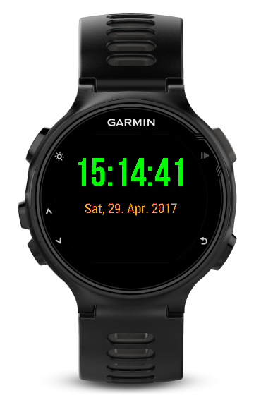
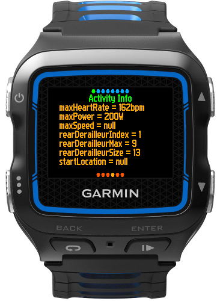
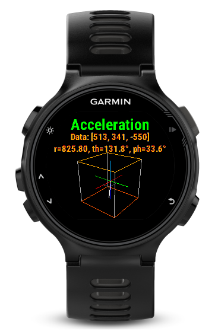

ConnectIQ -- Collection of Garmin Connect IQ apps
=================================================

This repository holds a collection of `Garmin Connect IQ apps
<https://developer.garmin.com/connect-iq/>`_.

Apps
----

- **SimpleWaF** (watch face) is a very simple watch face, just a finger
  exercise.

- **ShowAllInfos** (widget) retrieves all available information (e.g., screen
  size, heart rate, ...) and displays it.

- **SensorViz** (app) interactively visualizes the readings of the
  accelerometer and the magnetometer in 3D.

SimpleWaF
`````````

This watch face is really extremely simple and only displays the current time
and day. It doesn't consider low power mode, so the seconds value is just from
the time the display was updated the last.




ShowAllInfos
````````````

This widget shows all available information. The information is grouped in 8
sections with up to 40 items. The items are displayed page by page. Use the
up/down keys or swipe up/down to go through the pages. On the top, a page
indicator shows the current group. On the bottom, the current page within that
group is shown.




SensorViz
`````````

This app retrieves the sensor value 10 times per second and displays it in 3D.
Note that the calculations are quite CPU intensive and therefore will be slow
and drain the battery. On a FR920XT, the update is only approx. 3Hz.

The app includes a matrix math module in
`SensorViz/source/Matrix.mc <./SensorViz/source/Matrix.mc>`_ and a 3D drawing
module in `SensorViz/source/Graphics3D.mc <./SensorViz/source/Graphics3D.mc>`_.




Developing Connect IQ on Linux
------------------------------

These apps were developed on Linux using the command line, GVim, and Wine for
monkeyc, monkeydo, and the simulator. Please see the post
http://johann-glaser.blogspot.co.at/2016/10/garmin-connect-iq-on-linux.html for
detailed instructions. The apps have an improved `build script
<./SimpleWaF/build.sh>`_.
